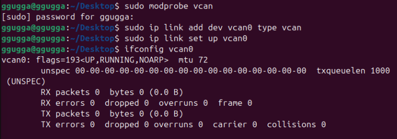
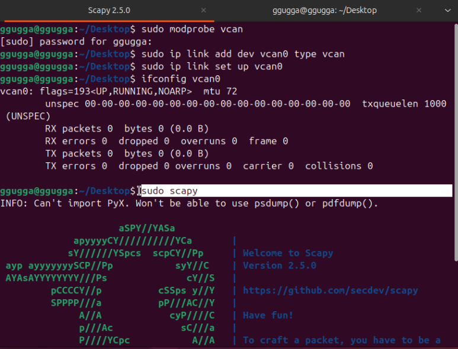
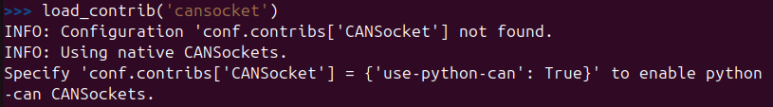
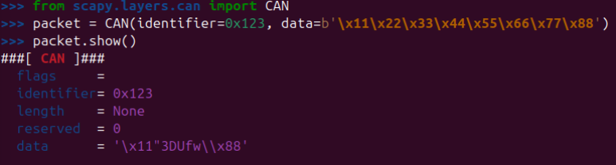
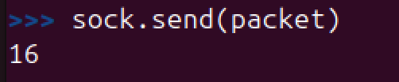
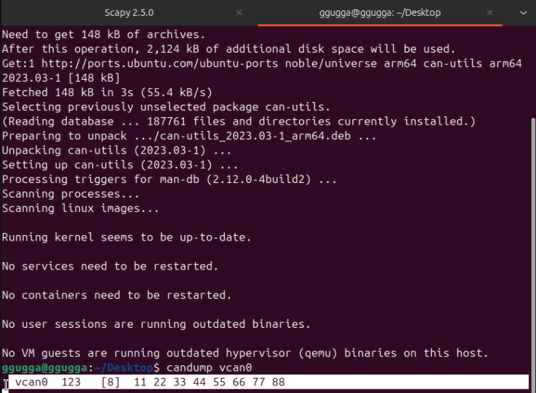

가상 CAN 인터페이스 (vcan0) 만들기

##과제: ifconfig vcan0 명령어 입력하고 출력결과 복사 붙여넣기 업로드

다른 창 열고

다시 원래창으로 돌아와서

원래의 터미널로 돌아와서 CAN 소켓 모듈 불러오기

소켓 연결하기
아까 만든 vcan0 인터페이스에 연결

악성(?) 패킷 만들기
자동차 계기판의 RPM을 조작한다고 상상하고 패킷을 만들어봅시다.

ID: 0x123 (메시지 종류 식별자)

Data: 0x11223344 (보낼 데이터)

CAN 패킷 생성 (Identifier=0x123, Data=8바이트)

packet = CAN(identifier=0x123, data=b'\x11\x22\x33\x44\x55\x66\x77\x88')

​내가 만든 패킷 정보 확인
packet.show()

소켓을 보내면?

#과제: 출력결과 복사 붙여넣기

공격 시나리오 정리
침투: 노트북을 자동차 네트워크(OBD-II 포트)에 연결함. (sock = CANSocket)
조작: "내가 엔진 컨트롤러인데..."라며 가짜 메시지를 만듦. (packet = CAN...)
공격: 네트워크에 가짜 메시지를 전송함. (sock.send)
결과: 자동차(candump)가 속아서 메시지를 받아들임. (성공!)

만약 이게 진짜 자동차였다면? 자동차의 계기판이나 다른 부품들은 이 신호가 진짜인지 가짜인지 구별하지 못합니다. 
(CAN 통신의 취약점) 그래서 차는 멈춰 있는데 계기판 속도계가 갑자기 올라가거나, 잠겨있던 문이 열리는 현상이 발생하게 됩니다.
