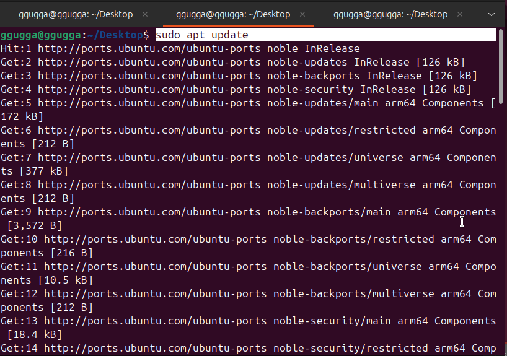
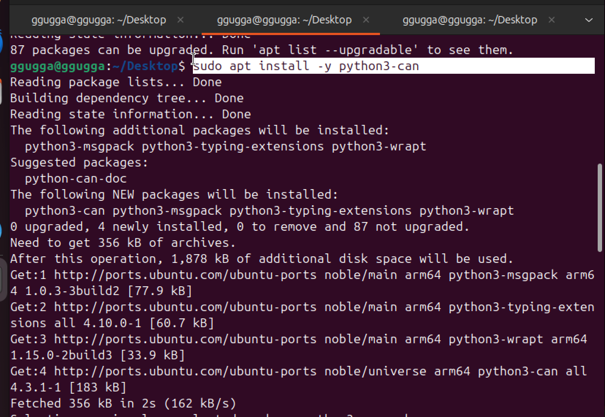
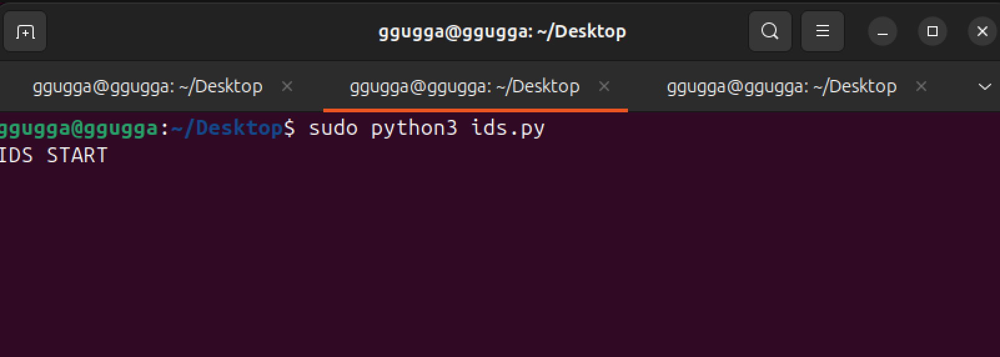
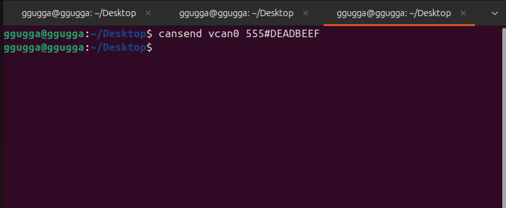
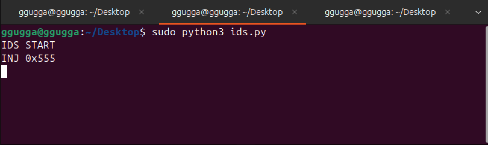
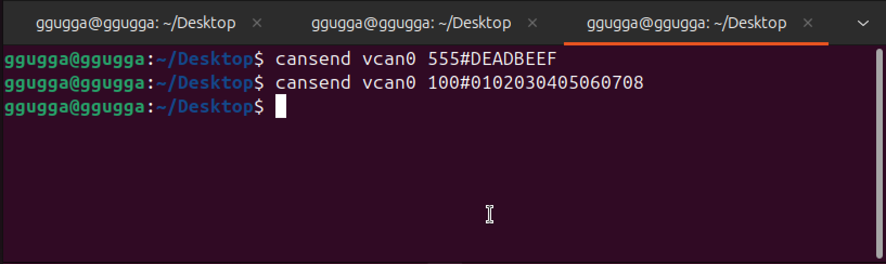
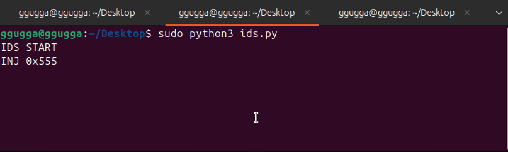
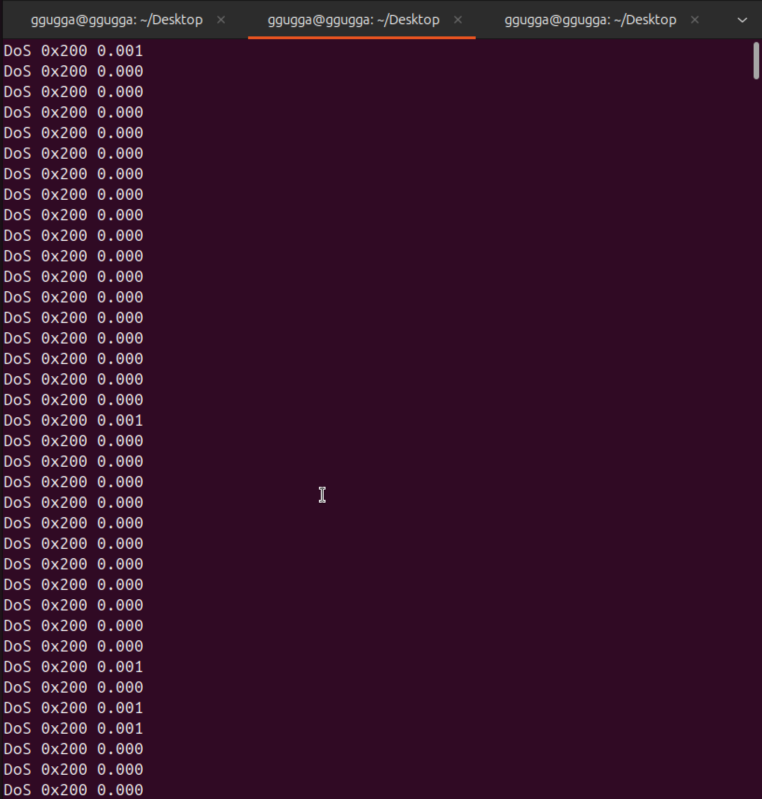

# CAN IDS (침입 탐지 시스템) 실습 보고서

본 실습은 가상 CAN 인터페이스(`vcan0`)를 구성한 후 

Scapy 기반 IDS를 구현하고 실행해보며 

정상 CAN 트래픽, 비인가 ID 인젝션 공격, 과도한 전송 주기의 Replay/DoS 공격을 각각 발생시키고 

IDS가 이를 정상/비정상으로 구분하여 탐지하는 과정을 다룹니다.

---

## 1. IDS 소스 코드 (`ids.py`)

실습에 사용된 파이썬 기반 IDS 코드입니다. 화이트리스트 및 전송 주기 위반을 체크합니다.

```python
import time
import can

IFACE = "vcan0"

WHITELIST_IDS = {0x100, 0x200, 0x300}
MIN_INTERVALS = {0x100: 0.1, 0x200: 0.01, 0x300: 0.05}
last_arrival_time = {}

bus = can.interface.Bus(channel=IFACE, bustype="socketcan")

print("IDS START")

while True:
    msg = bus.recv(timeout=1.0)
    if msg is None:
        continue

    can_id = msg.arbitration_id
    now = time.time()

    if can_id not in WHITELIST_IDS:
        print(f"INJ {hex(can_id)}")
        continue

    prev = last_arrival_time.get(can_id)
    if prev is not None:
        dt = now - prev
        if dt < MIN_INTERVALS.get(can_id, 0.05):
            print(f"DoS {hex(can_id)} {dt:.3f}")

    last_arrival_time[can_id] = now

## 2. 실습 개요
* **터미널 1:** 가상 CAN 인터페이스(vcan0) 준비
* **터미널 2:** IDS 실행 (방어자 시점)
* **터미널 3:** 정상 / 공격 CAN 패킷 송신 (공격자 시점)

---

## 3. 실습 단계별 기록

### [Terminal 1] 가상 CAN 네트워크 생성 및 환경 준비
가상 CAN 드라이버를 로드하고 인터페이스를 활성화하며, 실습에 필요한 패키지를 설치합니다.

```bash
# vcan 인터페이스 설정
sudo modprobe vcan
sudo ip link add dev vcan0 type vcan
sudo ip link set up vcan0
ip link show vcan0

# 패키지 업데이트 및 설치
sudo apt update
sudo apt install -y python3-can
```
### [Terminal 1] CAN 환경 준비 


---

### [Terminal 2] IDS 실행 (Monitoring)
준비한 `ids.py`를 실행하여 실시간 감시를 시작합니다. `python` 명령어로 실행되지 않을 경우 `python3`를 사용합니다.

```bash
sudo python3 ids.py
```



이후 clear해준 다음


---

### [Terminal 3] CAN 트래픽 생성 (공격자 시점)

#### 1. Injection 공격 (Whitelist 외 ID)
비인가된 CAN ID(`0x555`)를 전송하여 IDS가 이를 즉각 탐지하는지 확인합니다.

```bash
# Injection 공격 패킷 전송
cansend vcan0 555#DEADBEEF
```



**[IDS 탐지 확인 로그]**



#### 2. 정상 트래픽 전송
허용된 ID(`0x100`)를 정상 주기로 보낼 때, IDS는 아무런 탐지 로그를 출력하지 않습니다.

```bash
cansend vcan0 100#0102030405060708
```



---

**[IDS 탐지 확인 로그]**

아무것도 탐지되지 않습니다.

---

#### 3. Replay / DoS 공격 (과도한 전송 속도)
`while` 루프를 사용하여 매우 빠른 주기로 패킷을 주입, 주기 위반 기반 DoS를 탐지합니다.

```bash
# DoS 공격 수행 (ID 200번 플러딩)
while true; do cansend vcan0 200#AAAAAAAAAAAAAA; done
```


**[IDS 탐지 확인 로그]**


---

## 4. 실습 결론
IDS에서 설정한 규칙(화이트리스트 및 주기 분석)에 따라 공격을 정상적으로 구분하여 탐지함을 확인하고 성공적으로 실습을 마무리하였습니다.
