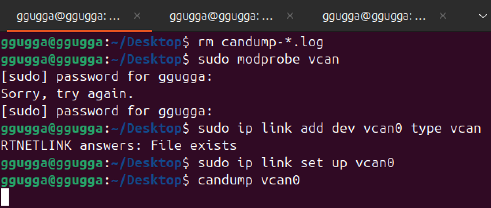
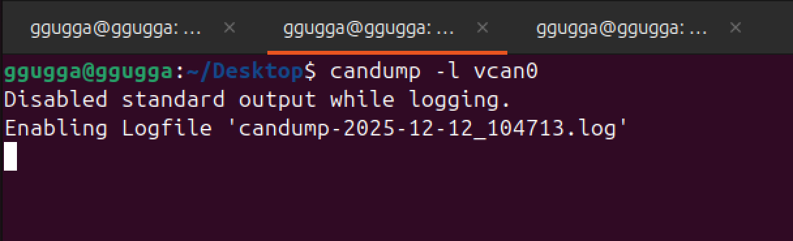
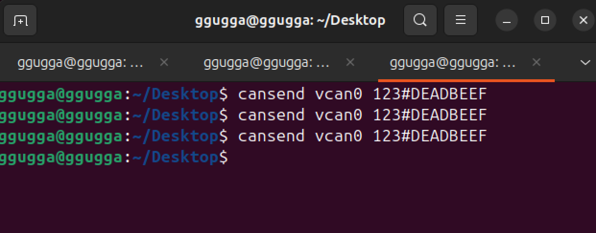
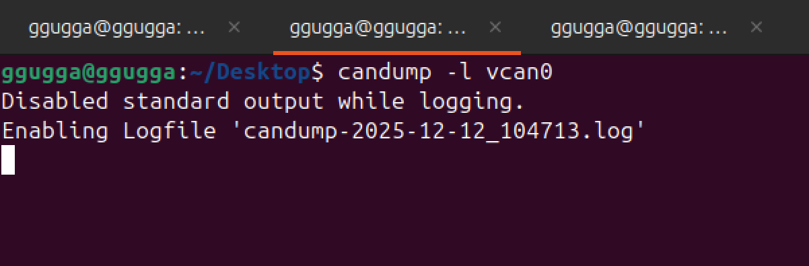
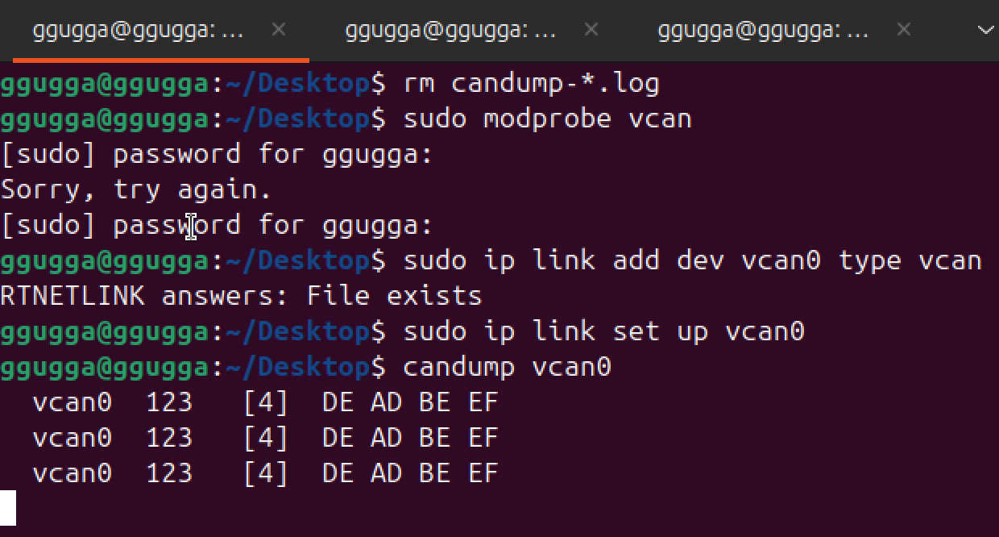
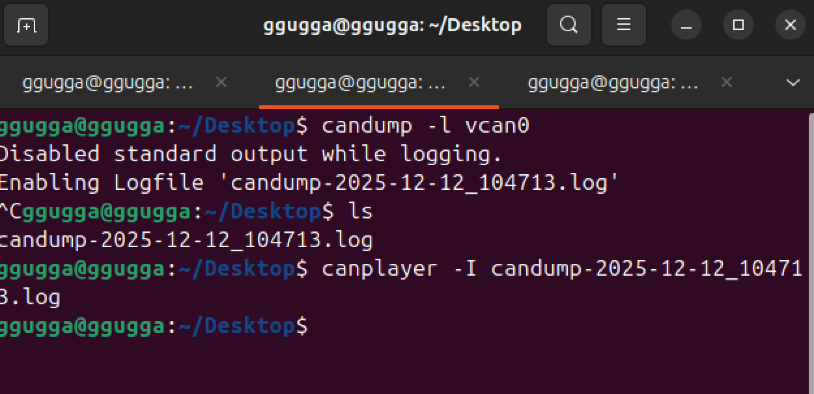
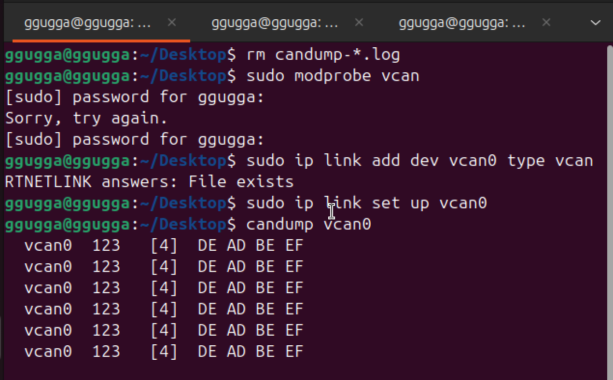

Replay Attack
이 실습은 터미널 창(Tab)을 3개 열어서 진행

## [창 1] 피해자(ECU) & 모니터링

이 창은 차량의 내부 네트워크 상황을 지켜보는 '계기판' 역할

modprobe: 기능 활성화 (뇌에 지식 주입)

add: 장치 생성 (하드웨어 조립)

set up: 전원 켜기 (작동 시작)

## [창 2] 해커 녹음 시작

## [창 3] 운전자가 문 열림 신호 발생시켰다고 가정

신호가 연속으로 3번 온 상황

[창 2]는 그 신호들을 녹음중

[창 1]는 운전자의 신호를 받고 있음

이제 녹음을 중단하고 로그 파일을 재실행

[창 1]는 운전자의 신호가 아닌 녹음된 내용을 정상신호로 인식하고 있음

재전송 공격 성공!

